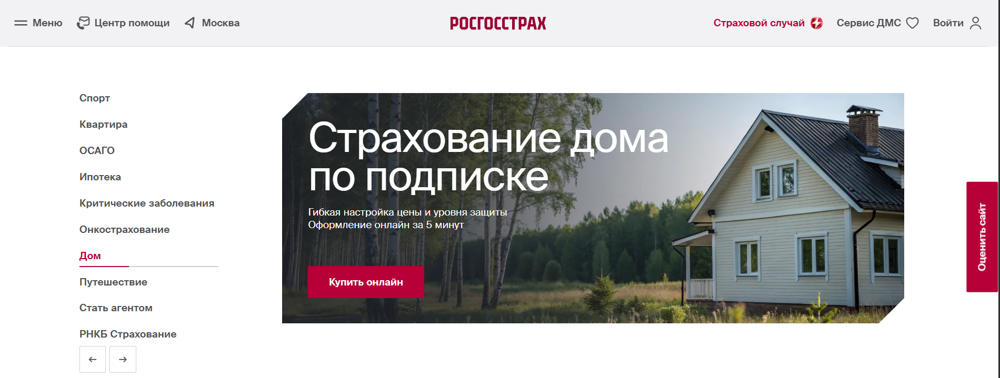
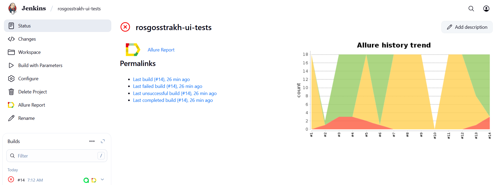
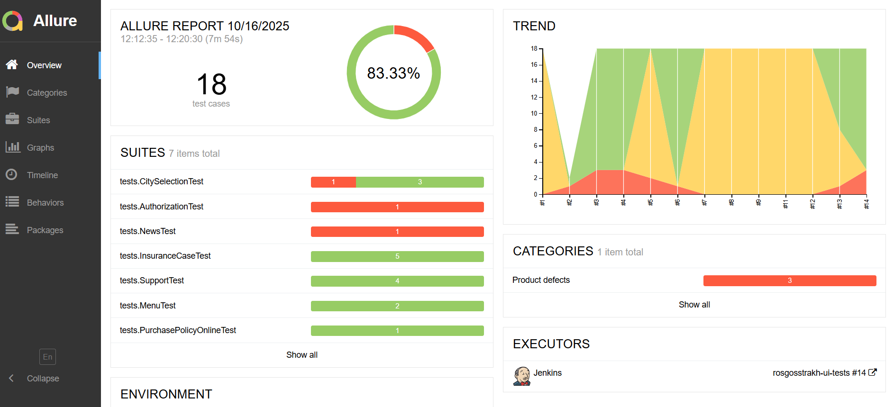
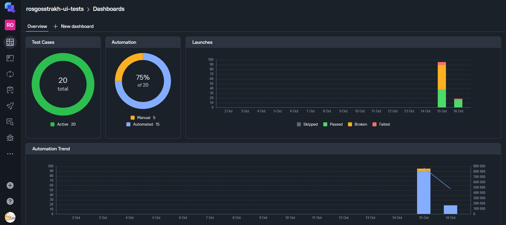
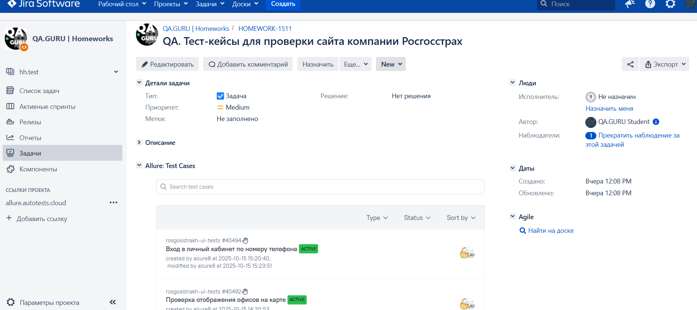
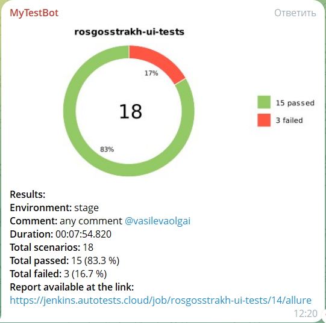
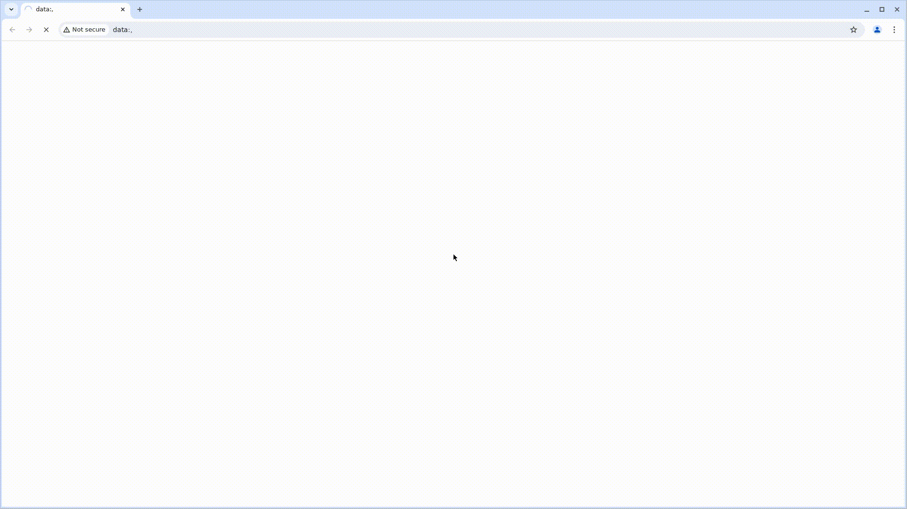

# Проект по автоматизации тестирования для компании [Росгосстрах](https://www.rgs.ru/)



> «Росгосстра́х» — российская страховая компания, предоставляющая широкий спектр услуг: автострахование (ОСАГО, КАСКО), страхование имущества, жизни, здоровья и ответственности. 
____

## **Содержание:**

* <a href="#tools">Технологии и инструменты</a>
* <a href="#cases">Примеры автоматизированных тест-кейсов</a>
* <a href="#console">Запуск из терминала</a>
* <a href="#jenkins">Сборка в Jenkins</a>
* <a href="#allure">Allure отчет</a>
* <a href="#allure-testops">Интеграция с Allure TestOps</a>
* <a href="#jira">Интеграция с Jira</a>
* <a href="#telegram">Уведомление в Telegram </a>
* <a href="#video">Видео примера запуска тестов в Selenoid</a>
____

<a id="tools"></a>
## **Технологии и инструменты**

<p align="center">
<a href="https://www.jetbrains.com/idea/"></a> 
<a href="https://www.java.com/ru/"></a>
<a href="https://selenide.org/"></a>
<a href="https://aerokube.com/selenoid/"></a>
<a href="https://github.com/allure-framework"></a>
<a href="https://qameta.io/"></a>
<a href="https://gradle.org/"></a>
<a href="https://junit.org/junit5/"></a>
<a href="https://github.com/"></a>
<a href="https://www.jenkins.io/"></a>
<a href="https://web.telegram.org/"></a>
<a href="https://www.atlassian.com/software/jira/"></a>
</p>


- Язык программирования для написания автотестов:
    - [Java](https://www.java.com/ru/)
- Фреймворки для тестирования:
    - [Selenide](https://selenide.org/) (для автоматизации браузерных тестов)
    - [JUnit 5](https://junit.org/) (для структурирования и запуска тестов)
- Сборка и управление зависимостями: [Gradle](https://gradle.org/)
- Запуск браузеров в [Selenoid](https://aerokube.com/selenoid/) при прогоне тестов
- CI/CD: [Jenkins](https://www.jenkins.io/) (реализована джоба для удаленного запуска тестов с формированием Allure-отчета и отправкой результатов в <code>Telegram</code> при помощи бота)
- Интеграция с [Allure TestOps](https://qameta.io/) и [Jira](https://www.atlassian.com/software/jira) (управление тест-кейсами и аналитика)

Содержание Allure-отчета:
* Шаги теста;
* Скриншот страницы на последнем шаге;
* Page Source;
* Логи браузерной консоли;
* Видео выполнения автотеста.

____
<a id="cases"></a>
## **Примеры автоматизированных тест-кейсов:**

- ✓ *Проверка ошибки при вводе неверного номера телефона*
- ✓ *Выбор города*
- ✓ *Информация о страховых случаях*
- ✓ *Навигация по меню*
- ✓ *Проверка вкладки новости*
- ✓ *Проверка категорий в разделе Покупка полиса онлайн*
- ✓ *Проверка вкладки поддержки*
____
<a id="console"></a>
***Запуск из терминала***

Для локального запуска тестов из терминала необходимо выполнить следующую команду
```
gradle clean test -Denv=local
```

Для запуска тестов в Selenoid из терминала необходимо выполнить команду
```
gradle clean test -Denv=remote 
```
Для удаленного выполнения тестов из терминала используется конфигурация из файла remote.properties:
- *browser (браузер для выполнения тестов - по умолчанию chrome)*
- *browserSize (размер окна браузера - по умолчанию 1920x1080)*
- *browserVersion (версия браузера - по умолчанию 127)*
- *baseUrl (адрес тестируемого веб-сайта - https://www.rgs.ru)*
- *remoteUrl (адрес удаленного сервера Selenoid с учетными данными)*

----
<a id="jenkins"></a>
##  Сборка в [Jenkins](https://jenkins.autotests.cloud/job/rosgosstrakh-ui-tests/)

Для запуска сборки необходимо перейти в раздел <code>Собрать с параметрами</code> и нажать кнопку <code>Собрать</code>.
<p align="center">

</p>

> Сборка с параметрами позволяет перед запуском задать нужные параметры для сборки:
<p align="center">

</p>

***Удаленный запуск через Jenkins***
```
clean test 
-Dbrowser=$browser 
-DbrowserSize=$browserSize 
-DbrowserVersion=$browserVersion 
-DbaseUrl=$baseUrl 
-DremoteUrl=$remoteUrl 
```
***Параметры сборки в Jenkins***

- *browser (браузер, в котором выполнятся тесты - по умолчанию chrome)*
- *version (версия браузера - по умолчанию 127)*
- *windowSize (размер окна браузера, в котором будут выполняться тесты)*
- *remoteUrl (адрес удаленного сервера, на котором будут запускаться тесты)*
- *baseUrl (адрес тестируемого веб-сайта)*
- *ENVIRONMENT (стенд для выполнения)*
- *COMMENT (тег чата для отправки отчета)*

____
<a id="allure"></a>
##  Пример [Allure-отчета](https://jenkins.autotests.cloud/job/rosgosstrakh-ui-tests/14/allure/)

<p align="center">

</p>

В отчете Allure представлены результаты тестирования с общей статистикой.
____
<a id="allure-testops"></a>
##  Интеграция с [Allure TestOps](https://allure.autotests.cloud/project/4951/dashboards)

Выполнена интеграция сборки <code>Jenkins</code> с <code>Allure TestOps</code>.
На дашборде представлен состав тест-кейсов (автоматизированные и ручные кейсы), запуски, результаты прогонов (успешные/неуспешные тесты)
<p align="center">

</p>

____
<a id="jira"></a>
##  Интеграция с [Jira](https://jira.autotests.cloud/browse/HOMEWORK-1511)

Реализована интеграция <code>Allure TestOps</code> с <code>Jira</code>,в тикете отображается информация, какие тест-кейсы были написаны в рамках задачи и результат их прогона.

<p align="center">

</p>

____
<a id="telegram"></a>

##  Уведомления в Telegram с использованием бота

После завершения сборки, бот созданный в Telegram, автоматически обрабатывает и отправляет сообщение с результатом.
<p align="center">

</p>

____
<a id="video"></a>

## Видео примера запуска тестов в Selenoid

К каждому тесту в отчете прилагается видео прогона.
<p align="center">
  
</p>